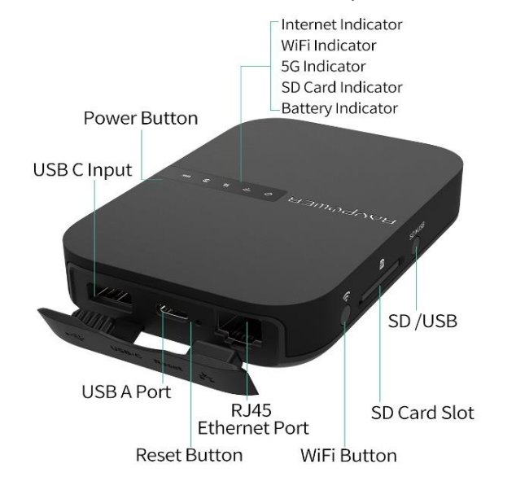
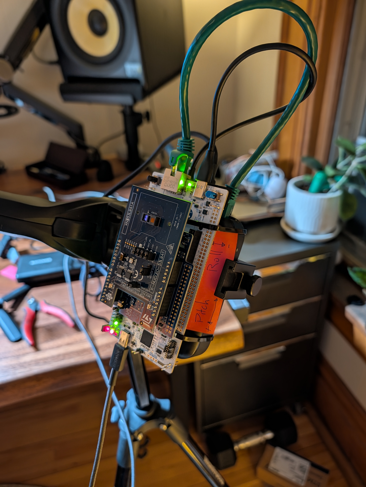

#  3D Roomscanner

A tethered handheld **3D room scanner**. This project aims to build a complete pipeline for 3D room capture: an STM32H563ZI board streams timestamped Time-of-Flight (ToF) and IMU/Environment sensor frames to a PC. The host PC runs real-time SLAM (using Open3D tensor ICP + TSDF), providing a live 3D reconstruction and tracking. Finally, an offline pass fuses 4K phone video into a ToF-seeded 3D Gaussian Splat.

---

##  System Architecture

The architecture consists of two main pillars:

### 1. Hardware & Firmware

<table>
  <thead>
    <tr>
      <th width="15%">Category</th>
      <th width="20%">Hardware</th>
      <th width="50%">Specifications & Role</th>
      <th width="15%">Image</th>
    </tr>
  </thead>
  <tbody>
    <tr>
      <td valign="top"><strong>MCU</strong></td>
      <td valign="top"><strong>STM32H563ZI</strong> (NUCLEO-H563ZI)</td>
      <td valign="top">
        <ul>
          <li><strong>Firmware:</strong> Bare-metal driving a double-buffered DMA setup via I3C.</li>
          <li><strong>Speed:</strong> Capable of emitting raw binary frames at 30+ fps.</li>
        </ul>
      </td>
      <td valign="top" align="center"></td>
    </tr>
    <tr>
      <td valign="top"><strong>Transport</strong></td>
      <td valign="top"><strong>RP-WD007</strong> (Travel Router)</td>
      <td valign="top">
        <ul>
          <li><strong>Connections:</strong> Streams via native USB CDC FS or Ethernet UDP (untethered DHCP client).</li>
          <li><strong>Power & Network:</strong> <em>Powered and networked via travel routers for wireless operation.</em></li>
        </ul>
      </td>
      <td valign="top" align="center"></td>
    </tr>
    <tr>
      <td valign="top"><strong>LIDAR</strong></td>
      <td valign="top"><strong>VL53L9CX</strong> (X-NUCLEO-53L9A1)</td>
      <td valign="top">
        <ul>
          <li><strong>Specs:</strong> 54×42 depth zones (2,268 points per frame), max range ~4000mm</li>
          <li><strong>FoV:</strong> 54.65° Horizontal / 42.50° Vertical</li>
          <li><strong>Speed:</strong> Streams raw <code>3DMD</code> data at 30+ fps over I3C + DMA</li>
          <li><strong>Role:</strong> Primary depth imager for SLAM tracking and point-cloud generation.</li>
        </ul>
      </td>
      <td valign="top" align="center"></td>
    </tr>
    <tr>
      <td valign="top"><strong>IMU & Env</strong></td>
      <td valign="top"><strong>Sensor Cluster</strong> (X-NUCLEO-IKS4A1)</td>
      <td valign="top">
        <ul>
          <li><strong>LSM6DSV16X (6-axis IMU):</strong> 3D accel (16g) + 3D gyro (4000 dps). Outputs hardware quaternions via its embedded Sensor Fusion Low Power (SFLP) core.</li>
          <li><strong>LIS2MDL (Magnetometer):</strong> 3-axis magnetic sensor, 50 Gauss, up to 100 Hz. Used for absolute heading and yaw-drift correction.</li>
          <li><strong>LPS22DF (Barometer):</strong> 260-1260 hPa absolute pressure. Vertical Z-drift constraint via barometric altitude changes.</li>
          <li><strong>SHT40 (Humidity & Temp):</strong> 0-100% RH, -40 to 125 °C.</li>
          <li><em>(Unused) LSM6DSO16IS:</em> Secondary 6-axis IMU with an ISPU.</li>
          <li><em>(Unused) LIS2DUXS12:</em> Secondary 3-axis ultra-low power accelerometer with Qvar.</li>
          <li><em>(Unused) STTS22H:</em> Secondary temperature sensor (0.5 °C accuracy).</li>
        </ul>
      </td>
      <td valign="top" align="center"></td>
    </tr>
    <tr>
      <td colspan="4" align="center">
        <strong>Fully Assembled Hardware Stackup</strong> 
        
      </td>
    </tr>
  </tbody>
</table>

### 2. Host PC Software (`roomscan`)
*   **Decoding & Transport:** Python package `roomscan` decodes the binary frame protocol and runs the `vl53l9-transform-c` pipeline host-side for uncompromised throughput.
*   **Real-time SLAM:** Point-to-plane ICP frame-to-model tracking against a TSDF VoxelBlockGrid using Open3D's tensor API on the GPU.
*   **Visualization:** A FastAPI and Three.js-based web server (`roomscan-web`) serving a rich real-time visualizer for point clouds, SLAM meshes, sensor states, and IMU metrics.

### Runtime data path

The MCU owns sensor timing: it triggers the ToF sensor, DMA-reads alternating raw
buffers, stamps the frame-ready edge, and packages raw ToF, calibration, and
available IMU/environment streams into CRC-protected `RSCN` frames. It can send
the same frames over native USB CDC and Ethernet UDP.

On the PC, one transport-neutral reader decodes live USB/UDP data or an
identically formatted recording. It records raw bytes when requested, builds the
native ToF transform from `CALIB`, transforms `RAW_3DMD` into depth and image
arrays, then feeds the web visualizer and optional GPU SLAM worker. Browser
controls travel back over the same protocol as COMMAND/ACK frames. See the
[runtime architecture guide](docs/system-architecture.md) for the complete
firmware and host flow.

---

##  Repository Layout

The project is organized into several layers. Start here, and follow the links to learn more about each component:

*   [**`firmware/`**](firmware/README.md) - Active firmware fork (`scanner-stream`) and vendored ST dependencies (`53L9A1`).
*   [**`host/`**](host/README.md) - PC Python package (`roomscan`), real-time SLAM pipeline, Web UI server, and diagnostics.
*   [**`docs/`**](docs/README.md) - Engineering practices, protocol specs, wiring guides, and architectural decisions.
*   [**`tools/`**](tools/README.md) - Project-level utilities, helper scripts, and Docker containers (e.g., offline SLAM).

##  Key Project Documents

*   [**`ROADMAP.md`**](ROADMAP.md) - Current-state doc: standing decisions, architecture, and the forward-looking work-item register (type-prefixed IDs by subsystem).
*   [**`docs/roadmap-history.md`**](docs/roadmap-history.md) - Completed-phase narratives and measured outcomes (the historical record behind the roadmap).
*   [**`BUGS.md`**](BUGS.md) - Bug tracker index for host and firmware issues; each bug's full entry lives in [`bugs/`](bugs/).
*   [**`CLAUDE.md`**](CLAUDE.md) - The primary system guidance and agentic instructions for working in this repo. Read this first if you are an agent contributing to the codebase.
