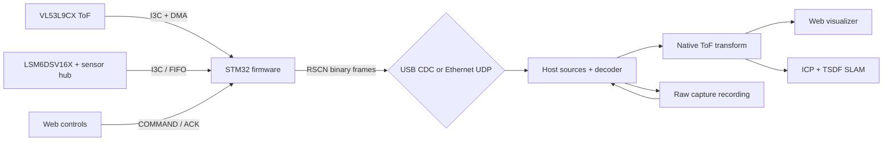

# Runtime Architecture

This is the implementation-level map of the scanner. It explains where a
measurement goes after the sensor produces it, which component owns each
boundary, and why raw data is transformed on the PC. For byte layouts and
stream IDs, use [the protocol specification](protocol.md); for coordinate
conventions, use [coordinate frames](coordinate-frames.md).

## Design at a glance

The STM32 controls timing and acquisition. It does not perform the normal
depth transform in the production configuration: it sends the VL53L9CX's raw
`3DMD` payload plus the calibration blob needed to interpret it. The host runs
ST's transform library natively, then fans the resulting depth, reflectance,
confidence, and ambient arrays out to the visualizer and SLAM pipeline. This
keeps the time-sensitive I3C/DMA loop short while putting the expensive,
inspectable work on the machine with GPU and memory headroom.

The two sides communicate through one versioned, CRC-protected binary protocol.
The same format is used over USB CDC, Ethernet UDP, and capture files, so a
recording exercises the same decoder, transform, viewer, and mapping code as a
live device.

## Firmware: acquire, timestamp, package, recover

The active application is
[`firmware/scanner-stream/`](../firmware/scanner-stream/); the similarly named
app below `firmware/vendor/53L9A1/` is ST reference code and is not modified.

### Bring-up

`Src/main.c` initializes the STM32 HAL, clocks, I3C1, GPDMA, USB hardware, and
Ethernet/lwIP before entering `vl53l9_app()`. The app initializes TinyUSB and
starts its free-running TIM2 microsecond clock before streaming, then:

1. Resets the ToF sensor, assigns I3C dynamic addresses, initializes the
   VL53L9CX, reads its calibration, applies the ranging profile, and starts
   manual ranging. Boot and later sensor failures use bounded re-init retries.
2. Initializes the optional LSM6DSV16X on the shared I3C bus. Its SFLP
   quaternion and sensor-hub environmental samples complement, but never block,
   the ToF stream.
3. Brings the native USB CDC device online only once it can service it. Ethernet
   is initialized independently; a host's first UDP datagram claims the unicast
   destination for Ethernet frames.

The green/red/yellow board LEDs provide coarse boot, fault, and acquisition-loop
liveness without requiring a debugger. Diagnostic text is emitted on the
separate ST-Link VCOM; it is not the scanner data channel.

### Per-frame loop

The ranging loop is deliberately pipelined:

1. Trigger a ToF exposure, wait for its frame-ready interrupt, and capture the
   frame-ready instant on the MCU clock.
2. Latch the IMU clock near that edge, then start an I3C DMA read into one of
   two raw buffers.
3. Acknowledge and parse the completed transfer. Commands, standby transitions,
   and reconfiguration run only at this safe point, never while a trigger is in
   flight.
4. Trigger the next exposure early, then package the completed raw buffer and
   associated IMU/environment data. The alternating buffer lets sensor DMA for
   one frame overlap CPU work and transport for the previous one.

Each ToF sequence normally produces `RAW_3DMD` (stream 7). `CALIB` (stream 8)
is resent periodically and after a re-init, so a newly attached host or replay
can construct a transform. The firmware also emits the SFLP quaternion (9),
environmental sample (10), raw IMU FIFO batch (11), IMU clock calibration (12),
and ToF-to-IMU synchronization measurement (13) when available. An on-device
transform mode remains for comparison/golden-data work, but raw streaming is
the normal path.

Frames are serialized as a header, payload, and CRC once, then offered to USB
CDC and/or Ethernet. Transmission is not allowed to halt acquisition: a busy or
unavailable link drops data and reports that fact through frame flags, sequence
numbers, counters, and EVENT frames. Ethernet uses paced, fragmented UDP;
the host reassembles it before protocol decoding.

### Control and failure policy

The host sends `COMMAND` frames for ping, calibration resend, ranging settings,
re-initialization, and soft or hard ToF standby. The firmware returns an `ACK`
that echoes the host token and reports the value actually applied. Sensor errors
become `EVENT` frames followed by bounded recovery attempts; a successful
recovery sends calibration again before raw streaming resumes. Exact command,
event, and compatibility rules live in [the protocol specification](protocol.md).

## Host: receive once, transform once, consume many times

The Python package is [`host/src/roomscan/`](../host/src/roomscan/). It keeps
I/O, wire decoding, transform, and consumers separate so the core data path is
testable without connected hardware.

### Ingestion and recording

`sources.py` supplies three interchangeable byte sources:

- `SerialSource` reads the native USB CDC device.
- `UdpSource` discovers the scanner through mDNS, periodically sends a small
  keepalive to retain the device's unicast target, and reassembles UDP fragments.
- `FileSource` replays a raw capture at a frame boundary.

On the wireless rig the Ethernet hop runs through the **Pi 3 bridge node** rather
than a commercial Wi-Fi bridge: the scanner plugs into the Pi's `eth0`
(172.31.100.1/24, dnsmasq handing its compile-time MAC a static 172.31.100.20
lease inside the firmware's 3000 ms DHCP window), and the Pi routes and NATs UDP
5000 out over `wlan0`. It publishes the `roomscanner._roomscan._udp` service on
`wlan0` only, so `UdpSource` resolves the Pi with no host-side change at all --
the transport looks identical from here. The bridge is additive: with it absent,
a plain Ethernet cable from the scanner to a laptop still works unchanged. It
also tees every scanner packet to a bounded local pcap ring, which is what makes
frames lost over the air recoverable after the fact
(`bridge_tee_fetch`/`pcap2capture.py`). Build, operation and failure playbook:
[`pi-bridge-runbook.md`](pi-bridge-runbook.md); design rationale:
[`superpowers/specs/2026-08-17-pi3-bridge-node-design.md`](superpowers/specs/2026-08-17-pi3-bridge-node-design.md).

`StreamDecoder` accepts arbitrary chunks from any source. It scans for the
`RSCN` magic, bounds payload lengths, verifies CRC32, and resynchronizes after
partial reads or corruption instead of trusting the link. `Recorder` tees the
original bytes to disk, making captures a faithful protocol-level record rather
than a rendered export.

The shared reader loop is the sole owner of a source and decoder. It routes
EVENT frames to the log bus, ACKs to `CommandClient`, all DATA frames to metrics
and sensor state, and transformed ToF frames to a latest-wins render slot. This
separation keeps a slow renderer, browser tab, or command write from starving
acquisition reads.

### Transform, geometry, and sensor state

`TransformStage` waits for a `CALIB` frame, constructs the native
`vl53l9-transform-c` wrapper, and uses it to turn following `RAW_3DMD` frames
into arrays. A changed calibration replaces the transform and resets its
transform-local state. Legacy `DEPTH_ZF32` captures remain supported as a direct
pass-through. `Deprojector` converts the depth grid into sensor-frame points;
optional flat-field calibration corrects reflectance before visual use.

`SensorState` receives the quaternion, environmental, raw-IMU, and clock-trim
streams independently of ToF transformation. It maintains recent orientation,
pressure, temperature, magnetic samples, and a short raw-IMU history. The
host's yaw fusion applies calibrated magnetometer data to reduce yaw drift;
[yaw fusion](yaw-fusion.md) records the model and limits. The high-rate
`ImuFusion` path is optional and remains disabled for SLAM by default. The
separate synchronization stream is decoded by protocol and capture-analysis
tools; it exposes the measured ToF-to-IMU timing rather than silently applying
a pose correction.

### Viewer and mapping consumers

`roomscan-web` is the primary UI. Its FastAPI server has one reader thread and
one broadcast task, so every WebSocket client receives the same most-recent
frame rather than competing for device bytes. The broadcaster produces compact
binary point-cloud, IR-image, and mesh messages plus JSON state, sensor,
metrics, command, capture, and log messages. The browser renders them with
Three.js; [the web protocol](web-protocol.md) is the browser-facing contract.

When mapping is selected, a `SlamWorker` receives depth and available orientation
and pressure priors without blocking the web event loop. It deprojects the depth
frame, estimates motion with point-to-plane ICP against the current model, and
integrates tracked frames into an Open3D tensor TSDF `VoxelBlockGrid` on the
selected device (CUDA when available). A separate mesh-preparation worker makes
render-ready mesh packets so extraction and serialization do not stall live
frame delivery. Mapping status, validation limits, and the offline detailed
workflow are described in [Phase 6 SLAM validation](phase6-slam-validation.md).

## Ownership boundaries

| Concern | Owner | Primary implementation |
|---|---|---|
| Sensor timing, I3C/DMA, frame timestamp, safe reconfiguration | Firmware | `firmware/scanner-stream/Src/vl53l9_app.c` |
| IMU FIFO and sensor-hub acquisition | Firmware | `firmware/scanner-stream/Src/rs_lsm.c` |
| Framing, checksum, stream IDs, commands | Shared contract | [protocol.md](protocol.md) |
| USB/UDP/file bytes, decoding, recording | Host | `host/src/roomscan/sources.py`, `decoder.py` |
| Raw-to-depth transform and deprojection | Host | `pipeline.py`, `native.py`, `deproject.py` |
| Browser fan-out and session control | Host | `web.py` |
| ICP, TSDF, mesh production | Host | `host/src/roomscan/slam/` |

## Related documentation

- [Protocol specification](protocol.md) — authoritative wire layout and stream semantics.
- [Transform streams](transform-streams.md) — transform outputs and their interpretation.
- [Coordinate frames](coordinate-frames.md) — sensor, world, Open3D/CV, and display conventions.
- [IKS4A1 stacking](iks4a1-stacking.md) — shared-bus wiring and sensor configuration.
- [Headless host setup](headless-host-setup.md) — deployment and first bring-up.
